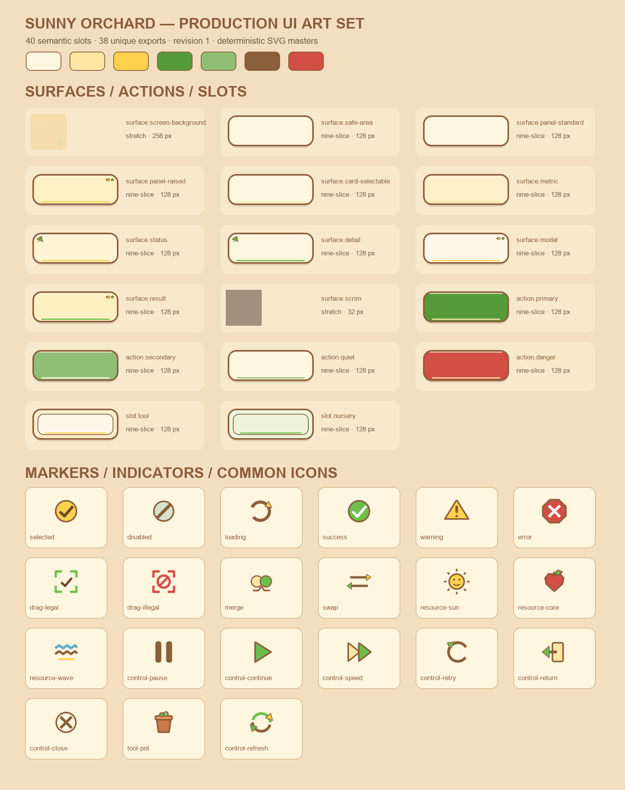

# Sunny Orchard production UI art evidence

## Result

A「阳光果园」was rebuilt as a complete production `RuntimeUiArtSet` rather than cropped from the approved style board. Set ID is `sunny-orchard`, revision is `1`, with exactly 40 semantic bindings and 38 unique standalone Sprite exports. `continue`, `start-wave`, and `start` intentionally bind the same play Sprite; all three bindings remain explicit.

## Production method

No image-generation call was used for production resources, so there is no production imagegen prompt. The imagegen skill's non-applicability boundary was followed: these assets are geometric nine-slice surfaces, state symbols, and an established vector-like icon family requiring exact borders, safe insets, stable paths, and deterministic re-export.

The checked-in pipeline `Assets/UI/Art/Sources/sunny-orchard/export_sunny_orchard.py` creates editable SVG masters and renders antialiased runtime PNGs with Pillow. It also writes stable Unity importer metadata, the ArtSet YAML, the machine-readable source/runtime manifest, and this gallery. The approved A board remains review-only and was not sampled, cropped, traced, or referenced by the ArtSet.

## Visual review

The gallery was inspected at original resolution against:

- approved A direction: `../style-board/artset-a-sunny-orchard-style-board.png`;
- current real Battle baseline: `../current-ui/battle-states/01-ready.png`.

The production family preserves the approved warm cream, shallow sunlight, amber, leaf green, muted sage, soil brown, and restrained fruit red roles. Nine-slice surfaces use a 4 px source outline at 2× scale (2 logical px), protected rounded corners, transparent gutter, a short warm shadow, and only corner-safe accents. The simpler treatment deliberately avoids the style board's generated texture noise and heavy illustration so Chinese copy and battlefield content remain dominant.

The production Primary Action token was minimally deepened from the reference-board leaf green to `#559A39` after real WebGL contrast review. Against inverse text `#FFF6E0` it measures approximately `3.216:1`, above the enforced `3.0:1` gate. Success and common-icon leaf accents intentionally remain `#6DBE4B`; only `action-primary.svg`, its in-place PNG export, manifest hashes, and the gallery changed.

The deterministic screen-background exporter now source-over composites its translucent orchard decorations onto the already opaque cream base. The earlier direct Pillow RGBA draws replaced destination alpha, leaving alpha `32` and `18` pixels that could expose the WebGL canvas; the corrected `surface-screen-background.png` has alpha `255` at all 65,536 pixels. Its path, dimensions, importer metadata, GUID `81c25e15dd0bd2802865ef47410f7840`, ArtSet binding, and editable SVG master are unchanged.

`surface.scrim` is the intentional exception to baked palette color: its owned master and runtime PNG are neutral opaque white. `RuntimeUiGui.DrawBlockingModal` applies `Theme.Colors.Scrim` and `Feedback.ScrimOpacity`, keeping tint and opacity under the single release theme rather than multiplying them by a pre-colored texture. The gallery displays the default theme-tinted result, not the raw white production pixel.

All critical state symbols have a shape cue in addition to color: selection/check, disabled/slash, loading/spinner, success/check, warning/triangle and exclamation, error/octagon and cross, legal/target and check, illegal/target and ban, merge/convergence, and swap/opposed arrows. Common icons share one 96×96 canvas and every visible alpha pixel stays within the uniform 12 px safe inset. No runtime text is baked into any asset.

## Automated and Unity validation

- manifest coverage: slots `0..39` exactly once; 40 unique semantic IDs; 38 unique runtime paths;
- asset ownership: every runtime PNG has one checked-in SVG master and matching manifest SHA-256/provenance;
- contrast refinement: A `action.primary` center pixels are exactly `#559A39`; the same value measured on the now-rejected treatment was a pre-rejection verification result, not a current production asset;
- opaque-background correction: during the pre-rejection two-set run only each set's `surface-screen-background.png` hash changed; all 74 then-present non-screen runtime PNG SHA-256 values and all 76 then-present PNG `.meta` SHA-256 values were unchanged;
- screen-background opacity: the approved A export contains exactly 65,536 alpha-`255` pixels; the historical rejected-treatment run reported the same result, and the regression smoke still rejects the pre-fix alpha sequence `255, 32, 18`;
- PNG inspection: RGBA, expected square dimensions, transparent nine-slice gutters, icon visible bounds within safe inset;
- naming: all production/source stems are lowercase ASCII kebab-case and contain no route name or revision suffix;
- Unity 6000.3.19f1 import: Sprite Single, Full Rect, sRGB, alpha transparency, Bilinear, Clamp, no mipmaps, Read/Write off, explicit uncompressed, correct Sprite border;
- ArtSet runtime validation: `SUNNY_ORCHARD_ART_SET_VALIDATION_PASS slots=40 set=sunny-orchard revision=1`;
- binding integrity: every `binding.Sprite.texture` is the same imported `binding.Texture`, with no atlas or Multiple sprite;
- clean post-helper Unity batch compile succeeded; the one-shot validator and its `.meta` were removed.

Unity evidence is in `unity-import-validation.log`, `unity-scrim-validation.log`, and `unity-clean-compile.log`.

Opaque-background production hashes:

- `surface-screen-background.png`: `7C03D410C71A1D0FD2C152F5A6C9C609377CC81A9DC002BFF05825E8F33E0E32` -> `FF30AE5A5FD1351A736596B1137EE419515AE3E4CC09042E96C6F372349B400C`;
- `art_manifest.json`: `A71F5AE7395DF31CA80D83FDBD871468C83F3879857E96EEEC6F8EB54D08CFA2`;
- production gallery: `D6F05AE0F3E870A1207FFFE1892D23353D6D37DCE48ED592D04DCD1752447960`.

## Remaining visual risk

This task validates the production resource family and component gallery, not its final composition on every route. Bootstrap/Lobby/Battle/Settlement conversion, Chinese copy density, actual narrow/wide nine-slice behavior, full/inset safe areas, and WebGL filtering still require their owning later tasks and real-canvas captures. The deliberately restrained flat surfaces may receive in-place color or micro-texture tuning after those captures, with the same paths/GUIDs and an incremented ArtSet revision; no alternate visual path is required.
